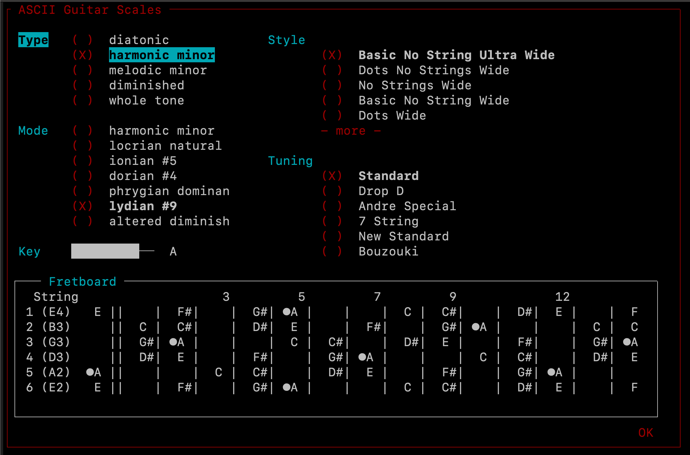

# python_music_1

This is a personal project in the **prototype stage**.  
This project is an opportinity for me to practice coding while creating a tool that is useful to me personally.

## Getting started
This project contains 2 separate projects (for now).
`./main/lib/` contains a library of object useful for music computations.
`./main/tui/` contains a hacked together text ui for exploring the capablities of the library.  
### Launching Text User Interface
From project root, run

```
pip install -r requirements.txt
./run_tui.py
```


## Cool things
- `NoteInterval` has a `%` operator.  Useful for `NoteInterval(semitones=13) % 12`
- Arithetic with `Note` and `NoteInterval`


## Road Map

### Library

#### Completed
- Classes: `Note`, `NoteInterval`, `Scale`, `Guitar`


#### Future Features
- Note naming, (flats)
- turn into real library which can be installed via `pip`
- Scale - detect scale
- Chords
	- detect chord
- Doc comments

### TUI Viewer

#### Completed
- Text UI (Basic)

#### Future Features
- scale info box
- monkey patch npyscreen to print color text output...
- More midi support (without pygame.midi)

## Future related projects
- pygame gui
- api


# Design Pattern examples (To do)
Factory
Dependency Injection


